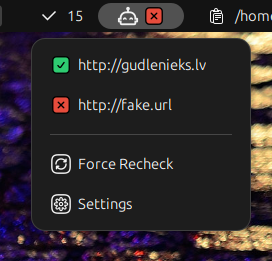

# Ping Bot - GNOME Shell Extension

A lightweight GNOME Shell extension that monitors the availability of your websites and services by periodically pinging URLs or IP addresses and displaying their status with visual indicators.
Monitor your important websites and devices at a glance. Add URLs or IPs to your list, see status indicators in the panel:
🟢 - Everything is ok, all targets reachable.
🟡 - Unknown or no network.
🔴 - Some target is not reachable.

## Icon Styles

Choose your preferred icon style:

**Freeicons (Default)**



**Material Design**


**Emoji**


## Why Ping Bot?

**Simple Local Monitoring** - Pings run directly from your machine, no external infrastructure needed:
No external services, no API keys, or accounts needed.
Similar to uptime robot services, but from your local machine.

**Comparison to Other Solutions:**
- no api keys
- no accounts
- request from local machine
- no history just status

## Features

- **Visual Status Indicators**: Color-coded indicators (green/yellow/red) show the health of all monitored targets
- **HTTP Monitoring**: Monitors websites and services via HTTP/HTTPS GET requests
- **IP/Ping Monitoring**: Monitor any device by IP address (IPv4 or IPv6) using ICMP ping — no web server required
- **Panel Menu**: Click the panel icon to see all monitored targets with their current status
- **Automatic Monitoring**: Configurable ping intervals
- **Network Awareness**: Automatically detects network connectivity before attempting to ping targets
- **Per-Target Status**: Each target displays its own status icon in the settings panel and dropdown menu
- **Real-time Updates**: Status icons update live in the preferences window and panel menu
- **Failure Notifications**: Receive GNOME notifications when targets fail (maximum once per hour)
- **Click to Open**: Click HTTP targets in the panel dropdown to open them in your default browser

## Installation

### Enable it trough GNOME Extensions website
https://extensions.gnome.org/extension/8777/ping-bot/

or

### Manual/local install - Quick Start (3 steps)

1. **Install the extension:**
   ```bash
   git clone https://github.com/lauzis/pingbot.git ~/.local/share/gnome-shell/extensions/pingbot@gudlenieks.lv
   ```

2. **Compile the settings schema:**
   ```bash
   cd ~/.local/share/gnome-shell/extensions/pingbot@gudlenieks.lv/schemas
   glib-compile-schemas .
   ```

3. **Enable the extension:**
   - Press `Alt+F2`, type `r`, press Enter (X11) OR log out and back in (Wayland)
   - Enable: `gnome-extensions enable pingbot@gudlenieks.lv`

### Getting Started

1. **Add targets**: Click robot icon → Settings → add URLs or IP addresses to monitor
2. **Configure**: Set ping interval
3. **Monitor**: Status updates automatically - click HTTP targets in panel to open them

## Usage

### Adding Targets to Monitor

1. Click on the robot icon in the top panel
2. Select Settings from the dropdown menu
3. In the "Targets to Monitor" section:
   - Select the monitor type: **HTTP** (for websites) or **Ping** (for IP/hostname)
   - Enter a URL (e.g., `https://example.com`) or an IP address (e.g., `192.168.1.1`)
   - Click **Add** or press Enter
4. The target will appear in the list with a status icon

### Status Indicators

The extension uses three colored circles to indicate status:

- 🟢 Green circle: Target is reachable
- 🟡 Yellow circle: Status unknown or no network connection
- 🔴 Red circle: Target is not reachable

### Panel Icon Logic

The main panel icon shows a robot emoji followed by a colored status circle:

- All URLs green: Panel shows robot + green circle
- All URLs yellow: Panel shows robot + yellow circle
- Any URL red: Panel shows robot + red circle (even if others are green)

### Panel Dropdown Menu

Click the panel icon to see:
- List of all monitored URLs with their current status
- Click any URL to open it in your default browser
- Settings button to access configuration

### Configuring Ping Interval

1. Open Settings (click robot icon → Settings)
2. Adjust the "Ping Interval" value (1-1440 minutes)
3. The extension will automatically use the new interval

### Deleting URLs

Click the trash icon next to any URL in the settings list to remove it from monitoring.

## How It Works

1. **Network Check**: Before pinging URLs, the extension checks for internet connectivity
2. **Periodic Pinging**: At the configured interval, the extension sends HTTP GET requests to each URL
3. **Status Update**: Based on the response (or lack thereof), each URL's status is updated
4. **Visual Feedback**: Icons in both the panel and settings window update to reflect current status
5. **Failure Notifications**: When a URL transitions from working to failed, a GNOME notification is sent (throttled to once per hour)
6. **Persistence**: All statuses are saved to GSettings and survive extension reloads

## Technical Details

### Architecture

- **Extension Type**: GNOME Shell Panel Extension
- **Language**: JavaScript (GJS)
- **Code Organization**: Modular architecture with `lib/` directory (7 focused modules)
- **Dependencies**: 
  - GNOME Shell
  - GTK4 (Adwaita)
  - libsoup (for HTTP requests)
  - GSettings (for configuration storage)
  - Gio.NetworkMonitor (for network connectivity checks)
  - 
### Settings Schema

The extension uses GSettings to store:

- `ping-interval` (integer): Time between pings in minutes
- `ping-urls` (array of strings): List of URLs to monitor
- `url-statuses` (JSON string): Cached status for each URL
- `request-timeout` (integer): Maximum time to wait for HTTP response in seconds
- `icon-style` (string): Style of the panel icon (freeicons, material, or emoji)
- `icon-size` (integer): Size of the panel icon in pixels

## Development

### Viewing Logs

Production logs:
```bash
journalctl -f -o cat /usr/bin/gnome-shell | grep "\[pingbot\]"
```

Debug mode (verbose):
```bash
G_MESSAGES_DEBUG=pingbot gnome-shell --replace
journalctl -f -o cat /usr/bin/gnome-shell | grep "\[pingbot\]"
```

### Debugging

Enable the extension and check for errors:

```bash
gnome-extensions info pingbot@gudlenieks.lv
```

### Testing in a Nested Session

On Wayland the extension cannot be reloaded in the running session — GNOME caches ES modules, so disabling and re-enabling re-runs the *old* code. To exercise changed code, start a nested shell:

```bash
G_MESSAGES_DEBUG=pingbot dbus-run-session -- gnome-shell --devkit --wayland
```

The nested shell reads the same dconf settings, so the extension enables automatically and its debug output appears on stdout. Note that it runs on its own session bus: to trigger settings handlers inside it, `gsettings` must be run with `DBUS_SESSION_BUS_ADDRESS` pointing at that bus, otherwise the change notification never reaches it.

On GNOME 49+ the flag is `--devkit`; older versions use `--nested`.

### Testing for Common Review Issues

Before submitting a new version to [extensions.gnome.org](https://extensions.gnome.org), run [Shexli](https://gitlab.gnome.org/GNOME/shexli) locally to catch common packaging and review issues early:

```bash
virtualenv venv
. venv/bin/activate
pip install -U shexli
shexli pingbot@gudlenieks.lv.zip
```

Run it against the **zip**, not the project folder. Shexli accepts a folder, but scanning this one reports three findings that are all false positives — `.git/hooks/*.sample` read as bundled binaries, plus `release.sh`, `.gitignore` and `schemas/gschemas.compiled` as build artifacts. `release.sh` already excludes every one of them, so the zip is the only meaningful target.

**Shexli is not sufficient on its own.** It reported `clean` for the 1.0.8 package that was subsequently rejected by review — it flags neither non-user files in the zip nor malformed `donations` values. Treat a clean run as a floor, not a pass.

## Known Limitations

- URLs must be accessible via HTTP/HTTPS GET requests
- Only HTTP and HTTPS protocols are supported (FTP, file://, etc. are rejected)
- Minimum ping interval is 1 minute (to avoid excessive network traffic)
- Network check uses GNOME's native NetworkMonitor API
- Notifications are throttled to once per hour to avoid spam

## Recent Updates

**Version 1.0.10** (July 29, 2026) - Added a version footer to the preferences window and a `version-name` entry in the extension metadata.

**Version 1.0.9** (July 28, 2026) - Addressed GNOME Shell extension review feedback: settings signals now use `connectObject()`/`disconnectObject()`, `donations` metadata values corrected to bare usernames, and development tooling excluded from the release package.

**Version 1.0.8** (July 3, 2026) - Fixed settings signal handlers not being disconnected on disable, per GNOME Shell extension review guidelines.

See [CHANGELOG.md](CHANGELOG.md) for complete version history.

## Compatibility

- **GNOME Shell**: 45, 46, 47, 48, 49, 50
- **Tested on**: Ubuntu 24.04, Ubuntu 24.10, Ubuntu 25.04, Ubuntu 25.10, Ubuntu 26.04, Fedora 40

## License

MIT License - see [LICENSE](LICENSE) file for details.

## Contributing

Contributions, bug reports, and feature requests are welcome!

## Author

Aivars Lauzis

Code mostly generated by [GitHub Copilot](https://github.com/features/copilot) and [Claude Code](https://claude.ai/code).

## Acknowledgements

- Code reviews by [CodeRabbit](https://coderabbit.ai/)
- AI-assisted development via [GitHub Copilot](https://github.com/features/copilot) and [Claude Code](https://claude.ai/code)

## Support Development

If you find this extension useful, consider supporting development:

Donate via PayPal: https://www.paypal.com/donate?token=mBDA_icmxwBEaawsjEBTbO0DqE74jH7k_ZX4_Bgtju4TKj35HO_aqQ0tFD8Wyh-TZ-xGHEk8dBrRAuJ7
Donate via PayPal: https://www.paypal.com/paypalme/Lauzis
Donate via GitHub: https://github.com/sponsors/lauzis

---

**Version**: 1.0.10
**Last Updated**: July 29, 2026
