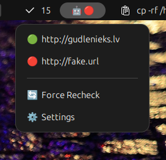

# Ping Bot - GNOME Shell Extension

A lightweight GNOME Shell extension that monitors the availability of your websites and services by periodically pinging URLs and displaying their status with visual indicators.



## Features

- **Visual Status Indicators**: Color-coded emoji indicators (green/yellow/red) show the health of your monitored URLs
- **Panel Menu**: Click the panel icon to see all monitored URLs with their current status
- **Automatic Monitoring**: Configurable ping intervals from 1 to 1440 minutes
- **Network Awareness**: Automatically detects network connectivity before attempting to ping URLs
- **Per-URL Status**: Each URL displays its own status icon in the settings panel and dropdown menu
- **Persistent State**: Status information is saved and persists across sessions
- **Real-time Updates**: Status icons update live in the preferences window and panel menu
- **Failure Notifications**: Receive GNOME notifications when URLs fail (maximum once per hour)
- **URL Validation**: Only valid HTTP/HTTPS URLs can be added to the monitoring list
- **Click to Open**: Click URLs in the panel dropdown to open them in your default browser

## Installation

1. Copy the extension to your GNOME Shell extensions directory:
   ```bash
   cp -r pingbot@gudlenieks.lv ~/.local/share/gnome-shell/extensions/
   ```

2. Compile the GSettings schema:
   ```bash
   cd ~/.local/share/gnome-shell/extensions/pingbot@gudlenieks.lv/schemas
   glib-compile-schemas .
   ```
   
   **Note**: The `gschemas.compiled` file is generated during installation and should not be committed to version control (it's in `.gitignore`).

3. Restart GNOME Shell:
   - **X11**: Press `Alt+F2`, type `r`, press `Enter`
   - **Wayland**: Log out and log back in

4. Enable the extension:
   ```bash
   gnome-extensions enable pingbot@gudlenieks.lv
   ```

## Usage

### Adding URLs to Monitor

1. Click on the robot icon in the top panel
2. Select Settings from the dropdown menu
3. In the "URLs to Monitor" section:
   - Enter a URL (e.g., `https://example.com`)
   - Click Add URL or press Enter
4. The URL will appear in the list with a status icon

Note: Only valid HTTP/HTTPS URLs are accepted. Invalid URLs will show a red border on the input field.

### Status Indicators

The extension uses three colored circles to indicate status:

- Green circle: URL is accessible (HTTP 200 OK)
- Yellow circle: Status unknown or no network connection
- Red circle: URL is not accessible or returned an error

### Panel Icon Logic

The main panel icon shows a robot emoji followed by a colored status circle:

- All URLs green: Panel shows robot + green circle
- All URLs yellow: Panel shows robot + yellow circle
- Any URL red: Panel shows robot + red circle (even if others are green)

### Panel Dropdown Menu

Click the panel icon to see:
- List of all monitored URLs with their current status
- Click any URL to open it in your default browser
- Settings button to access configuration

### Configuring Ping Interval

1. Open Settings (click robot icon → Settings)
2. Adjust the "Ping Interval" value (1-1440 minutes)
3. The extension will automatically use the new interval

### Deleting URLs

Click the trash icon next to any URL in the settings list to remove it from monitoring.

## How It Works

1. **Network Check**: Before pinging URLs, the extension checks for internet connectivity
2. **Periodic Pinging**: At the configured interval, the extension sends HTTP GET requests to each URL
3. **Status Update**: Based on the response (or lack thereof), each URL's status is updated
4. **Visual Feedback**: Icons in both the panel and settings window update to reflect current status
5. **Failure Notifications**: When a URL transitions from working to failed, a GNOME notification is sent (throttled to once per hour)
6. **Persistence**: All statuses are saved to GSettings and survive extension reloads

## Technical Details

### Architecture

- **Extension Type**: GNOME Shell Panel Extension
- **Language**: JavaScript (GJS)
- **Dependencies**: 
  - GNOME Shell 45/46
  - GTK4 (Adwaita)
  - libsoup (for HTTP requests)
  - GSettings (for configuration storage)

### File Structure

```
pingbot@gudlenieks.lv/
├── extension.js          # Main extension logic
├── prefs.js              # Settings UI
├── metadata.json         # Extension metadata
├── stylesheet.css        # Custom styles for error states
├── schemas/              # GSettings schema
│   ├── org.gnome.shell.extensions.pingbot.gschema.xml
│   └── gschemas.compiled (generated, not in git)
├── git-images/           # Screenshots for documentation
│   └── ping-bot.png
├── LICENSE               # MIT License
├── AGENTS.md             # Project structure documentation
└── README.md             # This file
```

### Settings Schema

The extension uses GSettings to store:

- `ping-interval` (integer): Time between pings in minutes
- `ping-urls` (array of strings): List of URLs to monitor
- `url-statuses` (JSON string): Cached status for each URL

## Development

### Testing in Nested Shell

For development and testing without affecting your main session:

```bash
MUTTER_DEBUG_DUMMY_MODE_SPECS=1920x1080 dbus-run-session -- gnome-shell --nested --wayland
```

### Viewing Logs

```bash
journalctl -f -o cat /usr/bin/gnome-shell | grep "Ping Bot"
```

### Debugging

Enable the extension and check for errors:

```bash
gnome-extensions info pingbot@gudlenieks.lv
```

## Troubleshooting

### Extension not showing in panel

1. Check if extension is enabled: `gnome-extensions list --enabled`
2. Check for errors: `journalctl -b -o cat | grep -i pingbot`
3. Restart GNOME Shell (Alt+F2 → r)

### Icons not updating

- Ensure network connectivity is available
- Check the ping interval setting (may need to wait for next cycle)
- Verify URLs are valid and accessible

### Settings window not opening

- Check GSettings schema is compiled: `ls schemas/gschemas.compiled`
- If missing, run: `glib-compile-schemas schemas/`

## Known Limitations

- URLs must be accessible via HTTP/HTTPS GET requests
- Only HTTP and HTTPS protocols are supported (FTP, file://, etc. are rejected)
- Minimum ping interval is 1 minute (to avoid excessive network traffic)
- Network check uses Firefox's detection portal (requires internet access)
- Notifications are throttled to once per hour to avoid spam

## Changelog

### Version 1.0 (November 2025)

Initial release with the following features:

- Panel icon with robot emoji and colored status indicator
- Click panel icon to see dropdown menu with all monitored URLs
- Click URLs in dropdown to open in default browser
- Settings page with URL management (add/delete)
- Real-time status updates with colored emoji indicators (green/yellow/red)
- Configurable ping interval (1-1440 minutes)
- Network connectivity detection before pinging
- URL validation (only HTTP/HTTPS allowed)
- Visual error feedback for invalid URLs
- Persistent status storage across sessions
- GNOME notifications for failures (once per hour)
- Support for GNOME Shell 45/46

## Compatibility

- **GNOME Shell**: 45, 46
- **Tested on**: Ubuntu 24.04, Fedora 40

## License

MIT License - see [LICENSE](LICENSE) file for details.

## Contributing

Contributions, bug reports, and feature requests are welcome!

## Author

Aivars Lauzis

Code mostly generated by GitHub Copilot CLI.

---

**Version**: 1.0  
**Last Updated**: November 2025
